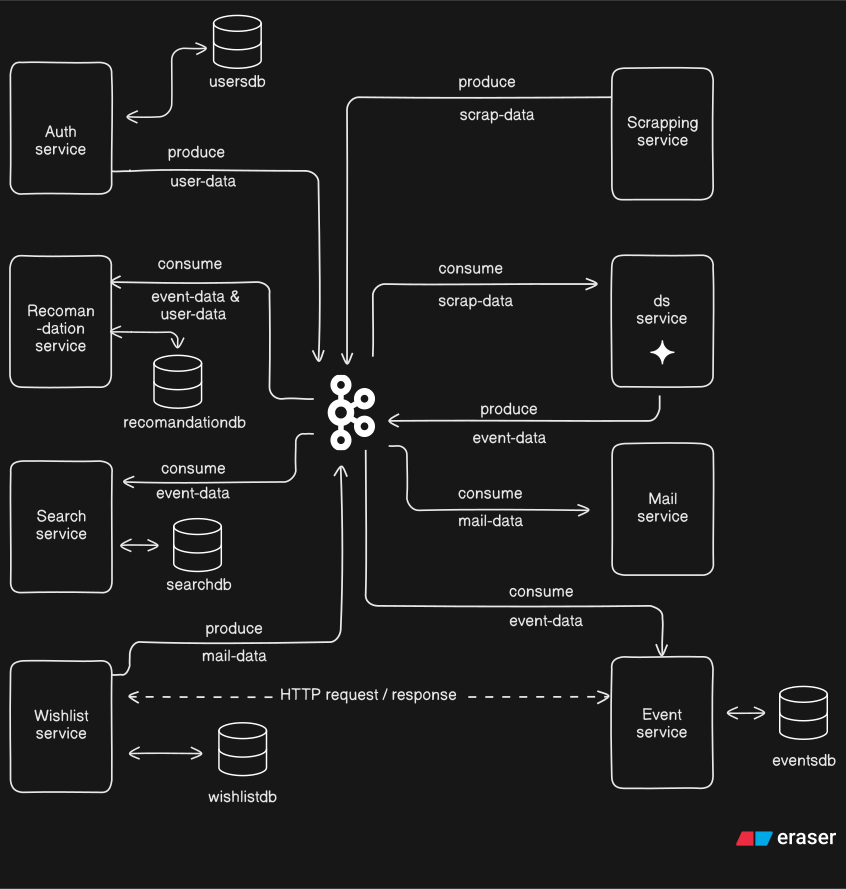

## Event Discovery Platform 

This repository contains the design and implementation for the Event Discovery Platform, a microservices-based system designed to aggregate, process, and deliver personalized event (jobs, internships, hackathons) information to users.

---

---

## System Architecture Diagram (Visual Overview)

 

---

## System Architecture: Microservices with Event Streaming

The system employs a **Microservices Architecture** where each business function is isolated into an independent service. **Apache Kafka** is central to this design, acting as the high-throughput, fault-tolerant message broker for asynchronous, decoupled communication between services.

### Key Architectural Principles

* **Decoupling:** Services communicate primarily via asynchronous **event streams (Kafka)**, preventing cascading failures and allowing independent scaling.
* **Domain Isolation:** Each service owns its data store, ensuring autonomy and clear data boundaries (e.g., Auth Service owns `usersdb`, Event Service owns `eventsdb`).
* **Asynchronous Processing:** Long-running tasks, like data processing (DS Service) and search indexing (Search Service), are handled asynchronously via Kafka events.
* **Mixed Communication:** While Kafka is the backbone, direct **HTTP API calls** are used for synchronous operations, such as front-end requests to the Event or Auth services, and specific inter-service triggers (e.g., from Wishlist to Mail Service).

---

## Data Transformation Example (DS Service: Input vs. Output) 
The table below illustrates the core transformation and standardization performed by the **DS Service**. It converts the inconsistent and sometimes abbreviated raw input into a clean, parsable, and standardized output format.

| Data Type | Example (Raw Input via `scrap-data`) | Example (Clean Output via `event-data`) | Transformation Focus |
| :--- | :--- | :--- | :--- |
| **Raw Input** | `start_date`: "Sep 09 ", `end_date`: "- Nov 01, 2025", `salary`: "$70,000" | `start_date`: "2025-09-09 00:00:00", `end_date`: "2025-11-01 23:59:59", `salary`: "Prize Pool: ₹62,10,925" | Date parsing, **USD to INR conversion**, salary normalization, text cleaning. |
| **Job/Internship** | `start_date`: "3 weeks ago", `salary`: "₹ 10,000 - 15,000 /month" | `start_date`: "2025-10-04 10:10:32", `salary`: "₹ 10,000 - 15,000 " | Relative date conversion, currency parsing. |

### Raw Input Data Example (DevPost Hackathon, via scrap-data)

```json

{
  "event_id": 1.7598520980326252e+18,
  "title": "Google Chrome Built-in AI Challenge 2025",
  "image_url": "https://d112y698adiu2z.cloudfront.net/photos/production/challenge_thumbnails/003/687/564/datas/medium_square.png", 
  "event_link": "https://googlechromeai2025.devpost.com/?ref_feature=challenge&ref_medium=discover",
  "location": "Global / Remote",
  "salary": "$70,000",
  "start_date": "Sep 09 ",
  "end_date": "- Nov 01, 2025",
  "type": "Hackathon",
  "description": "Beginner Friendly, Machine Learning/AI, Web"
}
```

### Standardized Output Data Example (Cleaned by DS Service, via event-data)
```json

{
  "event_id": "1759852098032625200", 
  "title": "Google Chrome Built-in AI Challenge 2025", 
  "image_url": "https://d112y698adiu2z.cloudfront.net/photos/production/challenge_thumbnails/003/687/564/datas/medium_square.png", 
  "event_link": "https://googlechromeai2025.devpost.com/?ref_feature=challenge&ref_medium=discover", 
  "location": "Global / Remote", 
  "salary": "₹6,210,925.00", 
  "start_date": "2025-09-09 00:00:00", 
  "end_date": "2025-11-01 23:59:59", 
  "type": "Hackathon", 
  "description": "This is a global, beginner-friendly hackathon focused on Machine Learning/AI and Web technologies."
}
```

## Data Flow and Communication

The platform's operation is defined by the lifecycle of two main entities: **Events** and **Users**.

### 1. Event Data Flow (Scrape $\rightarrow$ Publish $\rightarrow$ Consume)

1.  **Ingestion:** The Scraping Service automatically executes daily at 12 AM to retrieve new event data using Selenium. It also provides manual trigger APIs. The retrieved data is then produced as raw data to the scrap-data Kafka topic.
2.  **Transformation:** The **DS Service** (Data Science/Processing) **consumes** `scrap-data`, cleans it, standardizes dates, and shortens descriptions. It then **produces** the cleaned data to the `event-data` topic.
3.  **Distribution/Indexing:** Multiple services **consume** the final `event-data` for their specific functions:
    * **Event Service** stores the official record in `eventsdb` .
    * **Search Service** indexes the data into its `searchdb`, leveraging Standard SQL `LIKE` Search capabilities for query execution.
    * **Recommendation Service** stores the data in `recommendationdb` to train models and generate personalized user feeds.

### 2. User/Authentication Data Flow

1.  **Authentication:** The **Auth Service** handles sign-up and login, managing user credentials in `usersdb`.
2.  **Profile Events:** Upon significant changes (e.g., new user, preference update), the **Auth Service produces** a `user-data` event.
3.  **Consumption:** The **Recommendation Service consumes** `user-data` to update user profiles and personalize recommendations.

---

## Microservices and Responsibilities

The system is composed of the following services, detailing their role and interaction with the Kafka event stream:

| Service | Primary Function | Kafka Interaction | Data Store / Communication |
| :--- | :--- | :--- | :--- |
| **Scraping Service** | External data extraction. Runs on a daily schedule (12 AM). | **Produces to:** `scrap-data` | N/A |
| **DS Service** | Data cleaning and enrichment (description shortening, date fixing). | **Consumes from:** `scrap-data` **Produces to:** `event-data` | N/A |
| **Event Service** | Core event data management (CRUD operations). | **Consumes from:** `event-data` | `eventsdb` (Primary DB) |
| **Auth Service** | User authentication and identity management. | **Produces to:** `user-data` | `usersdb` |
| **Search Service** | Fast search and filtering on all events. | **Consumes from:** `event-data` | `searchdb` (Search Index) |
| **Recommendation Service** | Personalized event feed generation based on user preferences. | **Consumes from:** `event-data`, `user-data` | `recommendationdb` |
| **Wishlist Service** | Manages user-event favorites and reminder logic. | **Produces to:** `mail-data` (Inferred) | `wishlistdb`, HTTP call to Mail Service |
| **Mail Service** | Sends transactional emails (e.g., expiring event reminders). | **Consumes from:** `mail-data` (Inferred) | N/A |

---

## Kafka Topics (Asynchronous Contracts)

| Topic Name | Producer Service(s) | Consumer Service(s) | Event Type |
| :--- | :--- | :--- | :--- |
| **`scrap-data`** | Scraping Service | DS Service | Raw, uncleaned event JSON. |
| **`event-data`** | DS Service | Event, Search, Recommendation Services | Finalized, standardized event object. |
| **`user-data`** | Auth Service | Recommendation Service | User profile or preference changes. |
| **`mail-data`** | Wishlist Service (Inferred) | Mail Service (Inferred) | Payload to trigger an email send. |


---

## Technology Stack Overview

| Category                     | Technology           | Services Used In           | Purpose & Notes                                                                                   |
|-------------------------------|-------------------|---------------------------|--------------------------------------------------------------------------------------------------|
| Microservices Development      | Spring Boot (Java) | All Services (except DS)  | Primary framework for robust, scalable backend services.                                         |
| Python / LangChain             | Python / LangChain | DS Service Only           | Used for data cleaning, transformation, and complex logic involving AI/NLP.                     |
| Asynchronous Communication     | Apache Kafka       | All Services              | The central, high-throughput message broker for event streaming (Topics: `scrap-data`, `event-data`, `user-data`, `mail-data`). |
| Data Storage                   | MySQL              | All Services              | The single source of truth for all transactional data (`eventsdb`, `usersdb`, `wishlistdb`, `recommendationdb`). |
| Containerization               | Docker / Docker Compose | All Services & Infrastructure | Used for local development, defining the entire environment, and creating deployment artifacts. |
| Scraping Tool                  | Selenium           | Scraping Service          | Used for automated browser interaction to extract data from dynamic websites.                   |

---

---

## Service Structure

- **All Services (except DS):** Java Spring Boot microservices.  
- **DS Service:** Python service leveraging LangChain for AI/NLP tasks.  
- **Search Service:** Provides flexible SQL-like search capabilities.  
- **Scraping Service:** Uses Selenium to fetch dynamic content from websites and provides APIs for event data.  
- **Kafka Topics:** `scrap-data`, `event-data`, `user-data`, `mail-data`.  

---

## Scraping Service APIs

These APIs belong to the **Scraping Service**.

### 1. Get Internshala Jobs

**Request:**  
```http
GET scrapping-service/api/v1/data/internshala/jobs
```
**Response Example:**
```json
[
  {
    "event_id": 1.7598505746792433e+18,
    "title": "Video Editor",
    "image_url": "https://internshala.com/static/images/search/placeholder_logo.svg",
    "event_link": "https://internshala.com/internship/detail/video-editor-internship-in-ahmedabad-at-ranjan-rana1756799951",
    "location": "Ahmedabad",
    "salary": "₹ 10,000 - 15,000 /month",
    "start_date": "3 weeks ago",
    "end_date": "",
    "type": "Internship",
    "description": "Intern responsibilities at Iravaa Media (video editing)..."
  },
  {
    "event_id": 1.7598506012960074e+18,
    "title": "Search Engine Optimization (SEO)",
    "image_url": "https://internshala-uploads.internshala.com/logo%2Fg13qfru3a3p-27596.jpg.webp",
    "event_link": "https://internshala.com/internship/detail/search-engine-optimization-seo-internship-in-multiple-locations-at-devakey-digital-solutions-pvt-ltd1758861418",
    "location": "Pune, Pimpri-Chinchwad",
    "salary": "₹ 4,000 - 5,000 /month",
    "start_date": "1 week ago",
    "end_date": "",
    "type": "Internship",
    "description": "1. Conduct client research and keyword analysis to support SEO strategies..."
  }
]

```

### 2. Get Internshala Internships

**Request:**  
```http
GET scrapping-service/api/v1/data/internshala/internships
```

**Response Example:**
```json
[
  {
    "event_id": 1.7598518103629379e+18,
    "title": "Business Development Executive",
    "image_url": "https://internshala.com/static/images/search/placeholder_logo.svg",
    "event_link": "https://internshala.com/job/detail/business-development-executive-job-in-indore-at-toonzkart-ventures-private-limited1758867799",
    "location": "Indore",
    "salary": "₹ 3,80,000 - 4,64,000",
    "start_date": "1 week ago",
    "end_date": "",
    "type": "Job",
    "description": "As a business development executive at Toonzkart Ventures Private Limited, you will have the opportunity to work in a dynamic and fast-paced environment, where your skills in effective communication, written and spoken English proficiency, and MS Excel will be put to the test. Key Responsibilities: A. Leads calling & follow-up: 1. Demonstrate exceptional verbal and written communication abilities 2. Deliver an outstanding presentation 3. Practice active listening and empathy 4. Apply cross-cultural communication proficiency 5. Build rapport with diverse stakeholders B. Mailing: 1. Design compelling business presentations 2. Develop comprehensive business proposals 3. Visualize complex business opportunities 4. Communicate value propositions effectively 5. Demonstrate excellent prioritization and multitasking abilities 6. Show adaptability in dynamic business environments 7. Maintain meticulous attention to detail If you are a motivated individual with a passion for driving business success, we invite you to join our team and be a part of our exciting journey towards achieving our business goals. Apply now and take the next step in your career with Toonzkart Ventures Private Limited."
  },
  {
    "event_id": 1.7598518110265142e+18,
    "title": "Sales Executive",
    "image_url": "https://internshala-uploads.internshala.com/logo%2Fex08empjmk9-15831.jpg.webp",
    "event_link": "https://internshala.com/job/detail/sales-executive-job-in-hyderabad-at-spotlet1757013406",
    "location": "Hyderabad",
    "salary": "₹ 4,00,000 - 8,00,000",
    "start_date": "3 weeks ago",
    "end_date": "",
    "type": "Job",
    "description": "Key responsibilities: 1.Identify, prospect, and generate leads through various channels including referrals, networking, and real estate portals. 2.Conduct property presentations and site visits, highlighting features and benefits of villas and farmhouses. 3.Manage the entire sales cycle from lead generation to deal closure. 4.Build long-term client relationships to ensure repeat business and referrals. 5.Negotiate terms, finalize agreements, and ensure smooth transaction processes. 6.Achieve and exceed monthly/quarterly sales targets. 7.Provide accurate sales forecasts and market insights to management. 8.Maintain detailed records of interactions, leads, and closed deals in CRM. 9.Represent the company professionally at client meetings, events, and property exhibitions"
  },
]
```

### 3. Get DevPost Hackathons

**Request:**  
```http
GET scrapping-service/api/v1/data/devposts/hackathons
```


**Response Example:**
```json
[
  {
    "event_id": 1.7598520980326252e+18,
    "title": "Google Chrome Built-in AI Challenge 2025",
    "image_url": "https://d112y698adiu2z.cloudfront.net/photos/production/challenge_thumbnails/003/687/564/datas/medium_square.png",
    "event_link": "https://googlechromeai2025.devpost.com/?ref_feature=challenge&ref_medium=discover",
    "location": "Google",
    "salary": "$70,000",
    "start_date": "Sep 09 ",
    "end_date": "- Nov 01, 2025",
    "type": "Hackathon",
    "description": "Beginner Friendly, Machine Learning/AI, Web"
  },
  {
    "event_id": 1.759852098057366e+18,
    "title": "AWS AI Agent Global Hackathon",
    "image_url": "https://d112y698adiu2z.cloudfront.net/photos/production/challenge_thumbnails/003/702/784/datas/medium_square.png",
    "event_link": "https://aws-agent-hackathon.devpost.com/?ref_feature=challenge&ref_medium=discover",
    "location": "AWS",
    "salary": "$45,000",
    "start_date": "Sep 08 ",
    "end_date": "- Oct 20, 2025",
    "type": "Hackathon",
    "description": "DevOps, Enterprise, Machine Learning/AI"
  },
]
```

### 4. Publish Event to Kafka

**Request:**  
```json
POST scrapping-service/api/v1/data/events
Content-Type: application/json

{
  "event_id": 1759850574679243300,
  "title": "Sample Event",
  "image_url": "https://example.com/logo.png",
  "event_link": "https://example.com/event",
  "location": "Remote",
  "salary": "",
  "start_date": "2025-10-07",
  "end_date": "2025-10-15",
  "type": "Job",
  "description": "Sample event description."
}

```

**Response Example:**
```json
Event published successfully.
```


## Event Service API Endpoints
This section provides details and examples for the core data management API in the **Event Service**.

### 1. Create Event
**Request**
```http
Endpoint: event-service/api/v1/events

Method: POST

Role: The core service endpoint used internally (or by authorized clients) to persist standardized event data.
```

#### Request Body (Example):

```json
JSON
{
  "eventId": 101,
  "title": "Spring Boot Developer Job",
  "location": "Remote",
  "salary": "₹ 15,00,000",
  "start_date": "2025-11-01 09:00:00",
  "end_date": "2025-11-30 17:00:00",
  "type": "Job",
  "description": "Full-stack developer opportunity..."
}
```
Success Response (201 CREATED): Returns the saved EventModel object.

### 2. Update Existing Event
**Request**
```http
Endpoint: event-service/api/v1/events/{id}

Method: PUT

Success Response (200 OK): Returns the updated EventModel object.
```

### 3. Get Event by ID
**Request**
```http
Endpoint: event-service/api/v1/events/{id}

Method: GET

Success Response (200 OK): Returns a single EventModel.
```
**Response**
```JSON

{
  "event_id": 101,
  "title": "Spring Boot Developer Job",
  "location": "Remote",
  "salary": "₹ 15,00,000",
  "start_date": "2025-11-01 09:00:00",
  "end_date": "2025-11-30 17:00:00",
  "type": "Job",
  "description": "Full-stack developer opportunity..."
}
```

### 4. Get All Events
**Request**
```http
Endpoint: event-service/api/v1/events

Method: GET

Success Response (200 OK): Returns a list of EventModel objects.
```
**Response**
```JSON
[
    {
        "event_id": 101,
        "title": "Spring Boot Developer Job",
        "image_url": null,
        "event_link": null,
        "location": "Remote",
        "salary": "₹ 15,00,000",
        "start_date": "2025-11-01 09:00:00",
        "end_date": "2025-11-30 17:00:00",
        "type": "Job",
        "description": "Full-stack developer opportunity..."
    },
    {
        "event_id": 1759638358041797766,
        "title": "Video Editing/Making",
        "image_url": "https://internshala-uploads.internshala.com/logo%2F614e070b58af31632503563.png.webp",
        "event_link": "https://internshala.com/internship/detail/video-editing-making-internship-in-raipur-at-setmycart1759489610",
        "location": "Raipur, Devpuri (Hybrid)",
        "salary": "₹5000",
        "start_date": "2025-10-04 10:03:54",
        "end_date": "2025-10-31 23:59:59",
        "type": "Internship",
        "description": "SetMyCart seeks a talented Video Editor/Graphic Design intern. Responsibilities include editing and producing high-quality video and graphic content for web and social media. Collaborate with the marketing team on creative concepts. Utilize skills in Adobe Premiere Pro, Final Cut Pro, Adobe Photoshop, and Canva for video enhancement, graphics, and animations. Assist with social media marketing by creating video ads and promotional content. Stay updated on industry trends. The ideal candidate is passionate about video editing and eager to gain hands-on experience in a fast-paced environment."
    },
    {
        "event_id": 1759638359989643238,
        "title": "Travel Companion (PA)",
        "image_url": "https://internshala-uploads.internshala.com/logo%2F648984936ecf71686733971.png.webp",
        "event_link": "https://internshala.com/internship/detail/travel-companion-pa-internship-in-multiple-locations-at-wehire-talent-solutions1758018907",
        "location": "Mumbai, Virar, Vasai, Mira Bhayandar, Vasai-Virar (Hybrid)",
        "salary": "₹ 5,000 /month",
        "start_date": "2025-09-21 10:04:05",
        "end_date": "2025-10-31 23:59:59",
        "type": "Internship",
        "description": "Assist clients with travel planning, including booking flights, accommodations, and activities. Provide on-the-ground support during travel, ensuring clients' needs are met. Communicate with clients and vendors to coordinate travel arrangements. Utilize networking skills to build relationships with travel industry partners. Analyze data and metrics to optimize conversion rates and improve client satisfaction. Implement time management strategies to efficiently handle multiple client requests. Provide exceptional customer service and support to enhance the overall travel experience."
    }
]
```

### 5. Get Events by List of IDs
**Request**
```http
Endpoint: event-service/api/v1/events/by-ids?eventsIdList=101,1759638359998055036,1759638360003630720

Method: GET

Success Response (200 OK): Returns a list of EventModel objects matching the provided IDs.
```

```json
[
    {
        "event_id": 101,
        "title": "Spring Boot Developer Job",
        "image_url": null,
        "event_link": null,
        "location": "Remote",
        "salary": "₹ 15,00,000",
        "start_date": "2025-11-01 09:00:00",
        "end_date": "2025-11-30 17:00:00",
        "type": "Job",
        "description": "Full-stack developer opportunity..."
    },
    {
        "event_id": 1759638359998055036,
        "title": "Content and Social Media Marketing",
        "image_url": "https://internshala-uploads.internshala.com/logo%2F8hf1insp1qj-37990.png.webp",
        "event_link": "https://internshala.com/internship/detail/part-time-content-and-social-media-marketing-internship-in-multiple-locations-at-good-eatco1759064921",
        "location": "Dombivli, Dombivili",
        "salary": "₹ 4,000 - 5,000 /month",
        "start_date": "2025-09-29 10:04:23",
        "end_date": "2025-10-31 23:59:59",
        "type": "Internship",
        "description": "Good Eatco seeks a dynamic Content and Social Media Marketing intern. Gain hands-on experience in social media marketing, digital marketing tools, and content writing. Key Responsibilities include developing engaging social media content, assisting with marketing strategies, monitoring performance, collaborating on creative ideas, writing blog posts, staying updated on trends, and supporting the marketing team. Ideal for creative, driven individuals passionate about food and marketing."
    },
    {
        "event_id": 1759638360003630720,
        "title": "Graphic Design",
        "image_url": "https://internshala.com/static/images/search/placeholder_logo.svg",
        "event_link": "https://internshala.com/internship/detail/graphic-design-internship-in-gurgaon-at-ambrosia-botanical1759310569",
        "location": "Gurgaon",
        "salary": "₹ 5,000 - 12,000 /month",
        "start_date": "2025-10-02 10:04:31",
        "end_date": "2025-10-31 23:59:59",
        "type": "Internship",
        "description": "Assist in creating graphics for social media, presentations, websites, and marketing materials. Learn and contribute to design projects involving 3D graphics, animations, and short-form video content. Support in developing visuals like brochures, flyers, and promotional creatives. Translate simple briefs into creative design concepts. Take part in brainstorming sessions and provide fresh design ideas."
    }
]
```


-----

## Auth Service API Endpoints

This section provides details and examples for the authentication and user profile management API in the **Auth Service**.

| Endpoint | Method | Role | Success Status |
| :--- | :--- | :--- | :--- |
| `auth-service/api/v1/signup` | **POST** | Registers a new user and returns their profile with a JWT. | `201 CREATED` |
| `auth-service/api/v1/login` | **POST** | Authenticates a user and returns their profile with a JWT. | `200 OK` |
| `auth-service/api/v1/profile` | **GET** | Retrieves the details of the currently authenticated user. | `200 OK` |
| `auth-service/api/v1/profile` | **PATCH** | Updates the profile details (e.g., name, address, preferences) of the authenticated user. | `200 OK` |
| **`auth-service/api/v1/ping`** | **GET** | Checks the validity of the current user's session/JWT and returns the authenticated user's email. | `200 OK` |

### 1\. Register a New User (Sign Up)

**Request**

```http
Endpoint: auth-service/api/v1/signup

Method: POST

Role: Creates a new user in the system.
```

#### Request Body (Example):

```json
{
  "email": "john.doe@example.com",
  "password": "securepassword123",
  "firstName": "John",
  "lastName": "Doe",
  "phoneNumber": "1234567890",
  "address": "123 Main St, Anytown",
  "preferences": ["INTERNSHIP","JOB","HACKATHON"]
}
```

**Success Response (201 CREATED):** Returns the user's profile and JWT.

```json
{
  "email": "john.doe@example.com",
  "firstName": "John",
  "lastName": "Doe",
  "phoneNumber": "1234567890",
  "address": "123 Main St, Anytown",
  "preferences": ["INTERNSHIP","JOB","HACKATHON"],
  "token": "eyJhbGciOiJIUzI1NiIsInR5cCI6IkpXVCJ9..."
}
```

### 2\. Authenticate and Generate Token (Login)

**Request**

```http
Endpoint: auth-service/api/v1/login

Method: POST

Role: Authenticates user credentials and issues a JWT for subsequent requests.
```

#### Request Body (Example):

```json
{
  "email": "john.doe@example.com",
  "password": "securepassword123"
}
```

**Success Response (200 OK):** Returns the user's profile and JWT.

```json
{
  "email": "john.doe@example.com",
  "firstName": "John",
  "lastName": "Doe",
  "phoneNumber": "1234567890",
  "address": "123 Main St, Anytown",
  "preferences": ["INTERNSHIP","JOB","HACKATHON"]
  "token": "eyJhbGciOiJIUzI1NiIsInR5cCI6IkpXVCJ9..."
}
```

### 3\. Get User Profile Details

**Request**

```http
Endpoint: auth-service/api/v1/profile

Method: GET

Role: Retrieves the details of the user whose JWT is present in the Authorization header.
```

**Success Response (200 OK):** Returns the details of the authenticated user.

```json
{
  "email": "john.doe@example.com",
  "firstName": "John",
  "lastName": "Doe",
  "phoneNumber": "1234567890",
  "address": "123 Main St, Anytown",
  "preferences": ["INTERNSHIP","JOB","HACKATHON"]
}
```

### 4\. Update User Profile Details

**Request**

```http
Endpoint: auth-service/api/v1/profile

Method: PATCH

Role: Updates the profile details. Only fields present in the request body will be updated (PATCH-style).
```

#### Request Body (Example: Updating only phone number and preferences):

```json
{
  "phoneNumber": "9876543210",
  "address":"Jubli Hills , Hyderabad"
}
```

**Success Response (200 OK):** Returns the fully updated user profile DTO.

```json
{
  "email": "john.doe@example.com",
  "firstName": "John",
  "lastName": "Doe",
  "phoneNumber": "9876543210",
  "address":"Jubli Hills , Hyderabad",
  "preferences": ["INTERNSHIP","JOB","HACKATHON"]
}
```
### 5\. Check Session Validity (Ping)

**Request**

```http
Endpoint: auth-service/api/v1/ping

Method: GET

Role: A lightweight endpoint to quickly verify if the provided JWT/session token is valid and returns the email of the authenticated user.
```

**Success Response (200 OK):** Returns the email of the authenticated user.

```json
{
  "email": "john.doe@example.com"
}
```

**Failure Response (401 UNAUTHORIZED):** If no valid token is present.

```json
"Not authenticated"
```

-----

## Recommendation Service API Endpoints (Revised)

This section provides details and examples for the event consumption and personalized feed delivery API in the **Recommendation Service**.

| Endpoint | Method | Role | Success Status |
| :--- | :--- | :--- | :--- |
| `recommendation-service/api/v1/events` | **PUT** | **(Internal/Testing)** **Directly** receives and persists a cleaned event object to the local database. Used to **test data integrity** and maintain the local event store for recommendation modeling, bypassing the Kafka stream. | `200 OK` |
| `recommendation-service/api/v1/events` | **GET** | Retrieves all events stored locally in the recommendation database. Primarily for **internal testing/audit**. | `200 OK` |
| `recommendation-service/api/v1/events/feed` | **GET** | Generates and delivers a **personalized feed** of events for the authenticated user based on their preferences. | `200 OK` |

### 1\. Create or Update Event (Internal/Testing)

**Request**

```http
Endpoint: recommendation-service/api/v1/events

Method: PUT

Role: Internal endpoint used for **manual insertion or testing** of event data. This allows developers to directly verify the data persistence and service logic without relying on the Kafka message broker.
```

#### Request Body (Example):

```json
{
  "event_id": 1759850574679243300,
  "title": "Spring Boot Developer Job",
  "image_url": "https://example.com/logo.png",
  "event_link": "https://example.com/event",
  "location": "Remote",
  "salary": "₹ 15,00,000",
  "start_date": "2025-11-01 09:00:00",
  "end_date": "2025-11-30 17:00:00",
  "type": "Job",
  "description": "Full-stack developer opportunity..."
}
```

**Success Response (200 OK):** Returns the persisted `EventModel` object.

### 2\. Get All Events (Internal/Debug)

**Request**

```http
Endpoint: recommendation-service/api/v1/events

Method: GET

Role: Retrieves a list of all events stored in the recommendation service's database.
```

**Success Response (200 OK):** Returns a list of `EventModel` objects.

```JSON
[
    {
        "event_id": 1759591163066659794,
        "title": "Sales Associate",
        "image_url": "https://internshala.com/static/images/search/placeholder_logo.svg",
        "event_link": "https://internshala.com/job/detail/sales-associate-job-in-multiple-locations-at-yes-italy-edutech-pvt-ltd1755165308",
        "location": "Delhi, Mumbai",
        "salary": "₹ 4,00,000 - 10,50,000",
        "start_date": "2025-09-13 20:50:24",
        "end_date": "2025-10-31 23:59:59",
        "type": "Job",
        "description": "Key Responsibilities: Engage with prospective students and parents, providing personalized counseling on study abroad programs in Italy. Manage leads via calls, emails, and online platforms. Achieve monthly/quarterly sales targets by converting leads into enrollments. Leverage expertise in selling high-ticket products to build client trust. Collaborate with the admissions team for smooth application and visa processes. Maintain accurate records in the CRM system."
    },
    {
        "event_id": 1759591164424605461,
        "title": "Business Development Head - Chandigarh",
        "image_url": "https://internshala.com/static/images/search/placeholder_logo.svg",
        "event_link": "https://internshala.com/job/detail/part-time-business-development-head-chandigarh-job-in-chandigarh-at-ambrosia-botanical1759310528",
        "location": "Chandigarh",
        "salary": "₹ 3,00,000 - 6,00,000",
        "start_date": "2025-10-01 00:00:00",
        "end_date": "2025-10-31 23:59:59",
        "type": "Job",
        "description": "Key Responsibilities include launching state operations (hiring, training, team building), driving sales and market penetration, building partnerships with vendors, distributors, and clients. The role also involves researching market trends, implementing state-level marketing campaigns, managing budgets, optimizing costs, and reporting performance. Represent the startup as a brand ambassador and build a strong B2B and B2C market presence."
    }
]
```

### 3\. Get Personalized User Feed

**Request**

```http
Endpoint: recommendation-service/api/v1/events/feed

Method: GET

Role: Retrieves a paginated list of events personalized for the user identified by the email header.
```

#### Request Headers & Parameters:

| Header/Param | Type | Default | Description |
| :--- | :--- | :--- | :--- |
| `X-email` (Header) | String | *Required* | Email of the authenticated user to personalize the feed for. |
| `page` (Query Param) | Integer | 0 | The page number for pagination. |
| `size` (Query Param) | Integer | 10 | The number of events per page. |

**Example Request:**

```http
GET recommendation-service/api/v1/events/feed?page=1&size=5
X-email: john.doe@example.com
```

**Success Response (200 OK):** Returns a paginated list of **recommended** `EventModel` objects.

```JSON
[
    {
        "event_id": 1759591163066659794,
        "title": "Sales Associate",
        "image_url": "https://internshala.com/static/images/search/placeholder_logo.svg",
        "event_link": "https://internshala.com/job/detail/sales-associate-job-in-multiple-locations-at-yes-italy-edutech-pvt-ltd1755165308",
        "location": "Delhi, Mumbai",
        "salary": "₹ 4,00,000 - 10,50,000",
        "start_date": "2025-09-13 20:50:24",
        "end_date": "2025-10-31 23:59:59",
        "type": "Job",
        "description": "Key Responsibilities: Engage with prospective students and parents, providing personalized counseling on study abroad programs in Italy. Manage leads via calls, emails, and online platforms. Achieve monthly/quarterly sales targets by converting leads into enrollments. Leverage expertise in selling high-ticket products to build client trust. Collaborate with the admissions team for smooth application and visa processes. Maintain accurate records in the CRM system."
    }
]
```

## Search Service API Endpoints

This service is the primary source for **delivering event data to the frontend/website**. It provides fast indexing, search, and flexible filtering capabilities on all events.

| Endpoint | Method | Role | Success Status |
| :--- | :--- | :--- | :--- |
| **`search-service/api/v1/events`** | **POST** | **(Developer/Testing)** Manually receives and persists a cleaned event object directly to the local `searchdb` .| `200 OK` |
| **`search-service/api/v1/events/{id}`** | **GET** | Retrieves a single indexed event by its ID. Used to load the **Event Detail Page** on the website. | `200 OK` |
| **`search-service/api/v1/events/all`** | **GET** | Retrieves all indexed events (unpaginated). Used by the frontend for simple lists or **internal audit/testing**. | `200 OK` |
| **`search-service/api/v1/events/paged`** | **GET** | Retrieves a paginated list of all events. Used to display the **main event feed** or browsable lists. | `200 OK` |
| **`search-service/api/v1/events/type/{type}`** | **GET** | Retrieves all events matching a specific event type (e.g., Job, Internship, Hackathon). Used for **Type Filtering** on the website. | `200 OK` |
| **`search-service/api/v1/events/search`** | **GET** | Performs a full-text search across all event fields. Used to power the website's **Search Results Page**. | `200 OK` |

-----

### 1\. Create or Update Event Index (Developer/Testing)

**Request**

```http
Endpoint: search-service/api/v1/events

Method: POST

Role: An internal endpoint used **strictly for manual data injection** to verify data persistence in the `searchdb`. It does not interact with the Kafka topics, as data is consumed asynchronously.
```

#### Request Body (Example):

```json
{
  "event_id": 1759850574679243300,
  "title": "Spring Boot Developer Job",
  "location": "Remote",
  "salary": "₹ 15,00,000",
  "start_date": "2025-11-01 09:00:00",
  "end_date": "2025-11-30 17:00:00",
  "type": "Job",
  "description": "Full-stack developer opportunity..."
}
```

**Success Response (200 OK):** Returns the persisted `EventModel` object.

```json
{
  "event_id": 1759850574679243300,
  "title": "Spring Boot Developer Job",
  "location": "Remote",
  "salary": "₹ 15,00,000",
  "start_date": "2025-11-01 09:00:00",
  "end_date": "2025-11-30 17:00:00",
  "type": "Job",
  "description": "Full-stack developer opportunity..."
}
```

### 2\. Get Single Event by ID

**Request**

```http
Endpoint: search-service/api/v1/events/{id}

Method: GET

Role: Used by the frontend to fetch specific event details, typically for the detail page.
```

### 3\. Get All Events (Unpaginated)

**Request**

```http
Endpoint: search-service/api/v1/events/all

Method: GET

Role: Retrieves a complete list of all events.
```

### 4\. Get Events with Pagination

**Request**

```http
Endpoint: search-service/api/v1/events/paged

Method: GET

Role: Retrieves a paginated list of all events, suitable for displaying the main browsable feed on the website.
```

#### Query Parameters:

| Parameter | Type | Default | Description |
| :--- | :--- | :--- | :--- |
| `page` | Integer | 0 | The page number to retrieve. |
| `size` | Integer | 10 | The number of events per page. |

### 5\. Filter Events by Type

**Request**

```http
Endpoint: search-service/api/v1/events/type/{type}

Method: GET

Role: Filters and retrieves all events matching the specified event type (e.g., `Job`, `Internship`).
```

### 6\. Search Query (Full-Text Search)

**Request**

```http
Endpoint: search-service/api/v1/events/search

Method: GET

Role: Executes a full-text search on the indexed event data, powering the site's primary search bar functionality.
```

#### Query Parameters:

| Parameter | Type | Default | Description |
| :--- | :--- | :--- | :--- |
| `q` | String | *None* | The full-text search query string (e.g., `Java Developer`). |