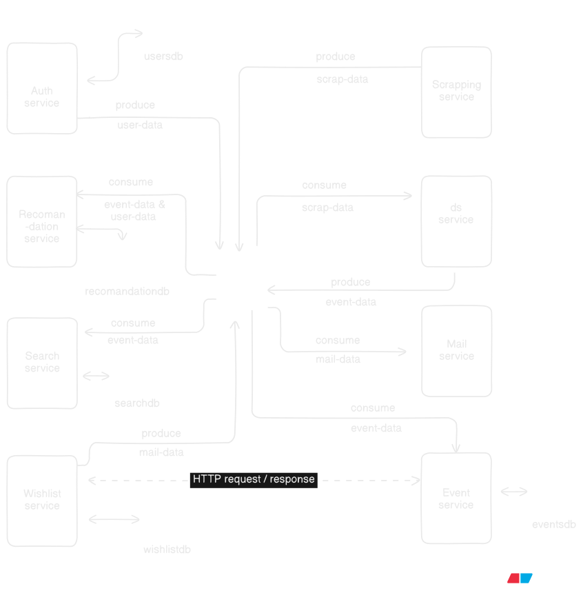

## Event Discovery Platform 

This repository contains the design and implementation for the Event Discovery Platform, a microservices-based system designed to aggregate, process, and deliver personalized event (jobs, internships, hackathons) information to users.

---

---

## System Architecture Diagram (Visual Overview)

 

---

## System Architecture: Microservices with Event Streaming

The system employs a **Microservices Architecture** where each business function is isolated into an independent service. **Apache Kafka** is central to this design, acting as the high-throughput, fault-tolerant message broker for asynchronous, decoupled communication between services.

### Key Architectural Principles

* **Decoupling:** Services communicate primarily via asynchronous **event streams (Kafka)**, preventing cascading failures and allowing independent scaling.
* **Domain Isolation:** Each service owns its data store, ensuring autonomy and clear data boundaries (e.g., Auth Service owns `usersdb`, Event Service owns `eventsdb`).
* **Asynchronous Processing:** Long-running tasks, like data processing (DS Service) and search indexing (Search Service), are handled asynchronously via Kafka events.
* **Mixed Communication:** While Kafka is the backbone, direct **HTTP API calls** are used for synchronous operations, such as front-end requests to the Event or Auth services, and specific inter-service triggers (e.g., from Wishlist to Mail Service).

---

## Data Flow and Communication

The platform's operation is defined by the lifecycle of two main entities: **Events** and **Users**.

### 1. Event Data Flow (Scrape $\rightarrow$ Publish $\rightarrow$ Consume)

1.  **Ingestion:** The **Scraping Service** polls external sources and **produces** raw data to the `scrap-data` Kafka topic.
2.  **Transformation:** The **DS Service** (Data Science/Processing) **consumes** `scrap-data`, cleans it, standardizes dates, and shortens descriptions. It then **produces** the cleaned data to the `event-data` topic.
3.  **Distribution/Indexing:** Multiple services **consume** the final `event-data` for their specific functions:
    * **Event Service** stores the official record in `eventsdb`.
    * **Search Service** indexes the data in `searchdb` for fast search capabilities.
    * **Recommendation Service** uses it to train models and generate user feeds.

### 2. User/Authentication Data Flow

1.  **Authentication:** The **Auth Service** handles sign-up and login, managing user credentials in `usersdb`.
2.  **Profile Events:** Upon significant changes (e.g., new user, preference update), the **Auth Service produces** a `user-data` event.
3.  **Consumption:** The **Recommendation Service consumes** `user-data` to update user profiles and personalize recommendations.

---

## Microservices and Responsibilities

The system is composed of the following services, detailing their role and interaction with the Kafka event stream:

| Service | Primary Function | Kafka Interaction | Data Store / Communication |
| :--- | :--- | :--- | :--- |
| **Scraping Service** | External data extraction. | **Produces to:** `scrap-data` | N/A |
| **DS Service** | Data cleaning and enrichment (description shortening, date fixing). | **Consumes from:** `scrap-data` **Produces to:** `event-data` | N/A |
| **Event Service** | Core event data management (CRUD operations). | **Consumes from:** `event-data` | `eventsdb` (Primary DB) |
| **Auth Service** | User authentication and identity management. | **Produces to:** `user-data` | `usersdb` |
| **Search Service** | Fast search and filtering on all events. | **Consumes from:** `event-data` | `searchdb` (Search Index) |
| **Recommendation Service** | Personalized event feed generation based on user preferences. | **Consumes from:** `event-data`, `user-data` | `recommendationdb` |
| **Wishlist Service** | Manages user-event favorites and reminder logic. | **Produces to:** `mail-data` (Inferred) | `wishlistdb`, HTTP call to Mail Service |
| **Mail Service** | Sends transactional emails (e.g., expiring event reminders). | **Consumes from:** `mail-data` (Inferred) | N/A |

---

## Kafka Topics (Asynchronous Contracts)

| Topic Name | Producer Service(s) | Consumer Service(s) | Event Type |
| :--- | :--- | :--- | :--- |
| **`scrap-data`** | Scraping Service | DS Service | Raw, uncleaned event JSON. |
| **`event-data`** | DS Service | Event, Search, Recommendation Services | Finalized, standardized event object. |
| **`user-data`** | Auth Service | Recommendation Service | User profile or preference changes. |
| **`mail-data`** | Wishlist Service (Inferred) | Mail Service (Inferred) | Payload to trigger an email send. |


---

## Technology Stack Overview

| Category                     | Technology           | Services Used In           | Purpose & Notes                                                                                   |
|-------------------------------|-------------------|---------------------------|--------------------------------------------------------------------------------------------------|
| Microservices Development      | Spring Boot (Java) | All Services (except DS)  | Primary framework for robust, scalable backend services.                                         |
| Python / LangChain             | Python / LangChain | DS Service Only           | Used for data cleaning, transformation, and complex logic involving AI/NLP.                     |
| Asynchronous Communication     | Apache Kafka       | All Services              | The central, high-throughput message broker for event streaming (Topics: `scrap-data`, `event-data`, `user-data`, `mail-data`). |
| Data Storage                   | MySQL              | All Services              | The single source of truth for all transactional data (`eventsdb`, `usersdb`, `wishlistdb`, `recommendationdb`). |
| Containerization               | Docker / Docker Compose | All Services & Infrastructure | Used for local development, defining the entire environment, and creating deployment artifacts. |
| Scraping Tool                  | Selenium           | Scraping Service          | Used for automated browser interaction to extract data from dynamic websites.                   |

---

---

## Service Structure

- **All Services (except DS):** Java Spring Boot microservices.  
- **DS Service:** Python service leveraging LangChain for AI/NLP tasks.  
- **Search Service:** Provides flexible SQL-like search capabilities.  
- **Scraping Service:** Uses Selenium to fetch dynamic content from websites and provides APIs for event data.  
- **Kafka Topics:** `scrap-data`, `event-data`, `user-data`, `mail-data`.  

---

## Scraping Service APIs

These APIs belong to the **Scraping Service**.

### 1. Get Internshala Jobs

**Request:**  
```http
GET /api/v1/data/internshala/jobs

**Response Example:**
```json
[
  {
    "event_id": 1.7598505746792433e+18,
    "title": "Video Editor",
    "image_url": "https://internshala.com/static/images/search/placeholder_logo.svg",
    "event_link": "https://internshala.com/internship/detail/video-editor-internship-in-ahmedabad-at-ranjan-rana1756799951",
    "location": "Ahmedabad",
    "salary": "₹ 10,000 - 15,000 /month",
    "start_date": "3 weeks ago",
    "end_date": "",
    "type": "Internship",
    "description": "Intern responsibilities at Iravaa Media (video editing)..."
  },
  {
    "event_id": 1.7598506012960074e+18,
    "title": "Search Engine Optimization (SEO)",
    "image_url": "https://internshala-uploads.internshala.com/logo%2Fg13qfru3a3p-27596.jpg.webp",
    "event_link": "https://internshala.com/internship/detail/search-engine-optimization-seo-internship-in-multiple-locations-at-devakey-digital-solutions-pvt-ltd1758861418",
    "location": "Pune, Pimpri-Chinchwad",
    "salary": "₹ 4,000 - 5,000 /month",
    "start_date": "1 week ago",
    "end_date": "",
    "type": "Internship",
    "description": "1. Conduct client research and keyword analysis to support SEO strategies..."
  }
]

```
2. Get Internshala Internships

Request:

GET /api/v1/data/internshala/internships


Response:
Similar JSON structure as jobs, containing internship-specific data.

3. Get DevPost Hackathons

Request:

GET /api/v1/data/devposts/hackathons


Response:
JSON array containing hackathon events scraped from DevPost.

4. Publish Event to Kafka

Request:

POST /api/v1/data/events
Content-Type: application/json

{
  "event_id": 1759850574679243300,
  "title": "Sample Event",
  "image_url": "https://example.com/logo.png",
  "event_link": "https://example.com/event",
  "location": "Remote",
  "salary": "",
  "start_date": "2025-10-07",
  "end_date": "2025-10-15",
  "type": "Job",
  "description": "Sample event description."
}


Response Example:

Event published successfully.


